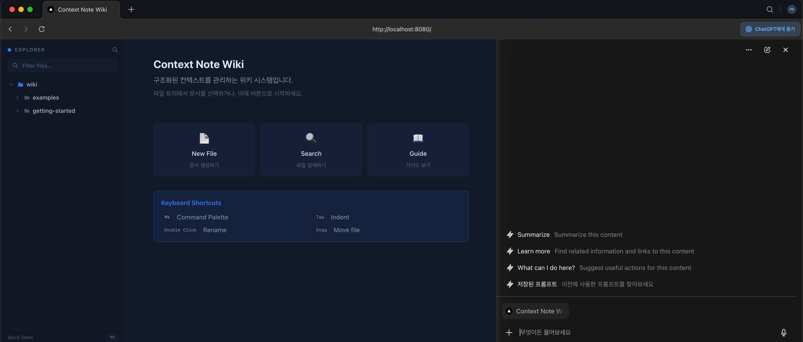
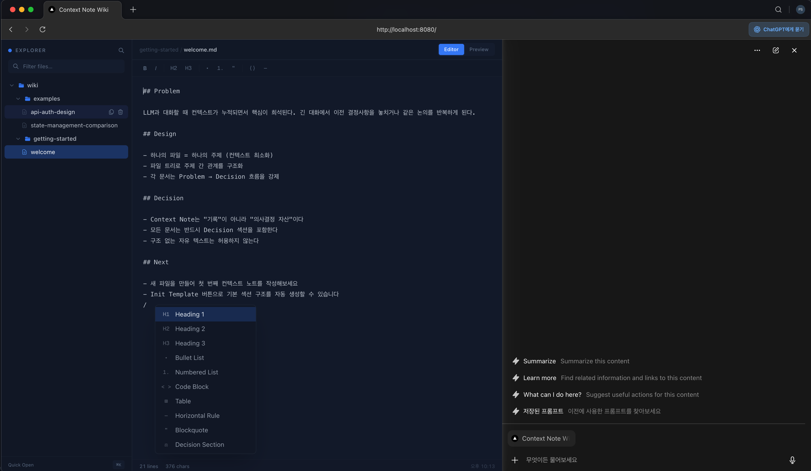
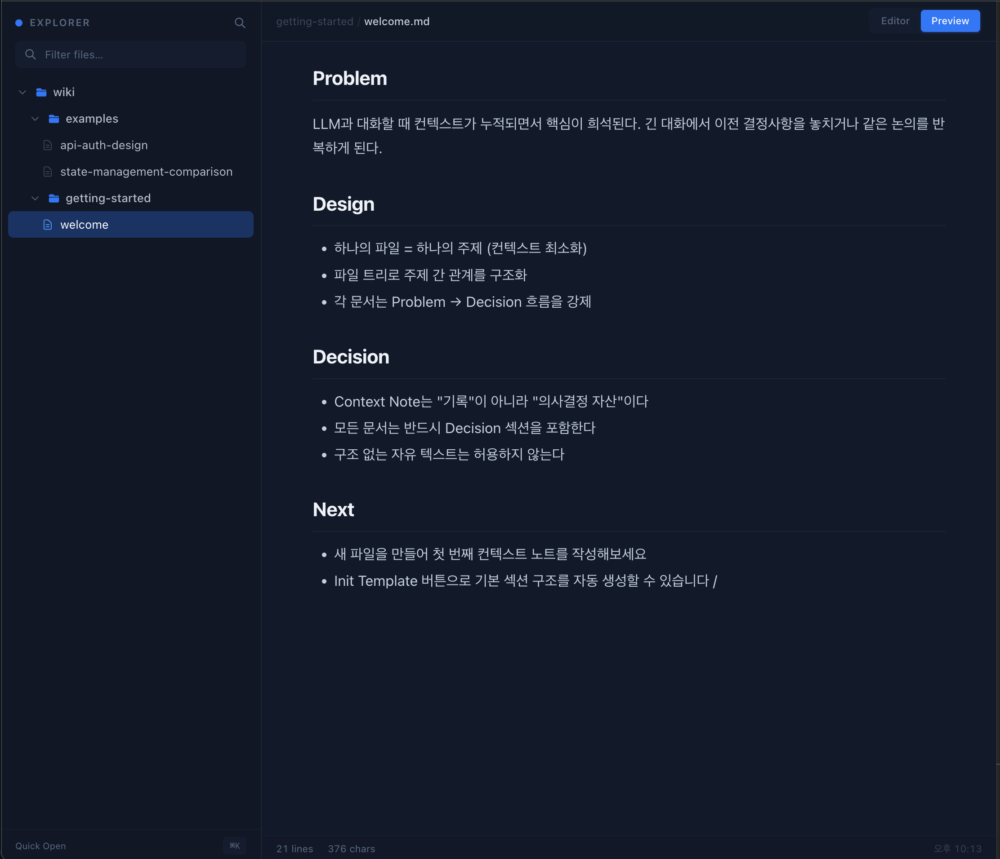

# Context Note

구조화된 Markdown 노트를 파일 트리 기준으로 관리하는 로컬 위키입니다.

LLM 대화, 설계 메모, 작업 기록처럼 문맥이 길어지는 내용을 `note/` 아래 파일과 폴더로 나눠 관리할 수 있습니다. 왼쪽에서는 트리를 탐색하고, 오른쪽에서는 바로 편집하거나 Preview로 렌더링 결과를 확인합니다.



## 실행 방법

### 1. Docker로 실행

가장 간단한 실행 방법입니다.

```bash
./start.sh
```

또는 직접 실행해도 됩니다.

```bash
docker compose up -d --build
```

접속 주소:

- `http://localhost:8080`

중지:

```bash
./stop.sh
```

주의:

- `start.sh`는 마지막에 `open http://localhost:8080`를 호출합니다. macOS 기준입니다.

### 2. 로컬 개발 서버로 실행

프론트엔드 개발이나 UI 수정이 목적이면 이 방식이 편합니다.

```bash
cd dev
npm install
npm run dev
```

접속 주소:

- `http://localhost:3000`

로컬 개발 모드에서는 기본적으로 저장소 루트의 `note/` 디렉터리를 사용합니다.

## 여러 프로젝트 관리

여러 위키를 각자의 포트로 동시에 띄울 때는 `start.sh` / `stop.sh` 의 멀티 프로젝트 옵션을 사용합니다. 포트는 8080부터 자동 할당되며 `projects/.ports` 에 등록됩니다.

```bash
# 새 프로젝트 자동 생성 + 기동 (./projects/<name>/note 스캐폴딩)
./start.sh my-wiki

# 기존 디렉토리를 위키 루트로 사용
./start.sh my-wiki --path /absolute/path/to/notes --port 8320

# 포트 강제 지정
./start.sh my-wiki --port 8090
```

> 프로젝트 이름은 소문자/숫자/`_`/`-` 만 허용됩니다 (docker compose 제약). 호스트 디렉토리 경로는 대소문자 무관.

중지:

```bash
./stop.sh my-wiki        # 이름으로
./stop.sh --port 8080    # 포트로
./stop.sh --all          # 등록된 모든 프로젝트
```

브라우저에서는 첫 실행 시 Project Picker가 떠서 어떤 프로젝트를 열지 선택합니다. 선택 결과는 브라우저 localStorage 에 저장되며, 좌측 상단에서 다시 열어 다른 프로젝트로 전환할 수 있습니다.

## 기본 사용 흐름

1. 왼쪽 파일 트리에서 폴더를 펼치고 문서를 선택합니다.
2. 파일이 없으면 폴더 hover 상태에서 새 파일 또는 새 폴더를 만듭니다.
3. 편집 화면에서 바로 Markdown을 수정합니다.
4. 입력 후 약 1초 뒤 자동 저장됩니다.
5. 상단의 `Editor` / `Preview` 전환으로 원문과 렌더링 결과를 확인합니다.

## 주요 기능

### 파일 트리

- 폴더 펼치기/접기
- 파일 선택
- 파일/폴더 생성
- 이름 변경
- 삭제
- 드래그 앤 드롭 이동
- 파일 스냅샷 생성 (`*_v1.md`, `*_v2.md` 형식)
- 이름 필터 검색

### 에디터

- Markdown 직접 편집
- 자동 저장
- 툴바로 자주 쓰는 블록 삽입
- `/` 입력 시 슬래시 메뉴 표시
- Preview 렌더링
- 문서 하단 저장 상태 표시
- `[[wikilink]]` 렌더링 및 미리보기 클릭 이동
- Backlink 패널

### 빠른 열기

- `Cmd+K` 또는 `Ctrl+K`
- 최근 파일 목록 표시
- 파일명 퍼지 검색
- 키보드로 바로 이동

## 단축키

- `Cmd+K` / `Ctrl+K`: Quick Open
- `Cmd+B` / `Ctrl+B`: Bold
- `Cmd+I` / `Ctrl+I`: Italic
- `Cmd+Shift+H` / `Ctrl+Shift+H`: H2 heading
- `Tab`: 들여쓰기
- `/`: 슬래시 메뉴

## 저장 위치

문서는 데이터베이스가 아니라 실제 파일로 저장됩니다. 모든 프로젝트는 `WORKSPACE_ROOT` 아래의 하위 디렉토리로 다뤄집니다.

```text
workspace/                  # WORKSPACE_ROOT
├── my-wiki/
│   └── note/
├── contextflow/
└── pocket-skill-router/
```

- 컨테이너 실행 시: 호스트의 `./projects` (또는 `--path` 로 지정한 절대경로) 가 `/workspace` 로 마운트됩니다.
- 로컬 개발 시: 기본값은 저장소 루트의 `../workspace` 입니다. `WORKSPACE_ROOT` 환경 변수로 덮어쓸 수 있습니다.
- API 호출은 모두 `?project=<name>` 쿼리/바디 파라미터로 어느 프로젝트인지 명시합니다.

## 프로젝트 구조

```text
context-note-docker/
├── docker-compose.yml
├── start.sh
├── stop.sh
├── note/                  # 실제 문서 저장소
├── images/                # README 이미지
└── dev/                   # Next.js 앱
    ├── src/app/
    │   ├── page.tsx
    │   └── api/
    │       ├── tree/
    │       ├── file/
    │       ├── folder/
    │       ├── rename/
    │       └── projects/
    ├── src/components/
    │   ├── FileTree/
    │   ├── Editor/
    │   ├── ProjectPicker/
    │   └── CommandPalette/
    ├── src/store/
    └── src/lib/
```

## 개발 메모

자주 쓰는 명령:

```bash
cd dev
npm run lint
npm run build
```

현재 빌드는 환경에 따라 Google Fonts(`Geist`, `Geist Mono`) 네트워크 접근이 막히면 실패할 수 있습니다.

## 스크린샷

### Editor



### Preview


